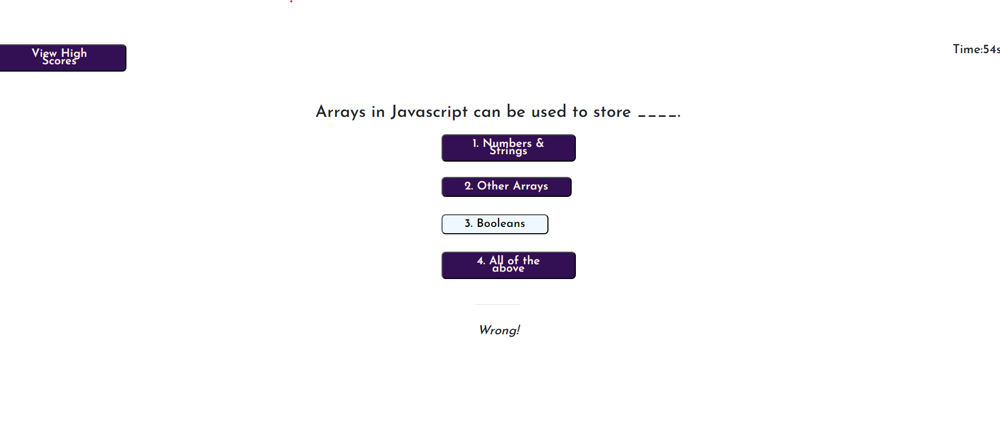

# Challenge - 4 - Coding A Timed Quiz using JavaScript, HTML, and CSS

## Description

This is a timed quiz, created to test your knowledge about JavaScript programming language. I wanted to create this quiz to test my limitations. It turns out I have got many. While it was challenging to create this project from scratch, I had fun coding the timer, it was also a critical acceptance criterion. This project is a product of everything we have learned in the past weeks. When we time ourselves and do a test about any topic that we have learned, it tells us how much we have understood.

## Table of Contents

- [Installation](#installation)

- [Usage](#usage)
  
- [Credits](#credits)
  
- [License](#license)

- [Tests](#tests)

## Installation

The URL will mostly work in all browsers. The preferred Browser is Google Chrome and the extension Chrome DevTools Extension to view the source code. GitHub is a cloud service for projects/repositories. You can simply visit the URL to view the repository in your browser: 
[GitHub Repo](https://github.com/hafsah1976/coding-timed-quiz)

## Usage

The interface is simple and contains keywords to guide the user in navigating through the quiz. 

## Credits 

[Bootstrap Reference](https://getbootstrap.com/docs/4.0/components/card/)

[Simple JavaScript Quiz](https://simplestepscode.com/javascript-quiz-tutorial/)

[MDN Documentation](https://developer.mozilla.org/en-US/docs/Web/API/Element/innerHTML)

[Creating a Timer](https://www.educative.io/answers/how-to-create-a-countdown-timer-using-javascript)

## License

Permission is hereby granted, free of charge, to any person obtaining a copy of this software and associated documentation files (the “Software”), to deal in the Software without restriction, including without limitation the rights to use, copy, modify, merge, publish, distribute, sublicense, and/or sell copies of the Software, and to permit persons to whom the Software is furnished to do so, subject to the following conditions:

The above copyright notice and this permission notice shall be included in all copies or substantial portions of the Software.

THE SOFTWARE IS PROVIDED “AS IS”, WITHOUT WARRANTY OF ANY KIND, EXPRESS OR IMPLIED, INCLUDING BUT NOT LIMITED TO THE WARRANTIES OF MERCHANTABILITY, FITNESS FOR A PARTICULAR PURPOSE, AND NONINFRINGEMENT. IN NO EVENT SHALL THE AUTHORS OR COPYRIGHT HOLDERS BE LIABLE FOR ANY CLAIM, DAMAGES, OR OTHER LIABILITY, WHETHER IN AN ACTION OF CONTRACT, TORT, OR OTHERWISE, ARISING FROM, OUT OF, OR IN CONNECTION WITH THE SOFTWARE OR THE USE OR OTHER DEALINGS IN THE SOFTWARE.

## Tests

1. Testing the Timer Countdown: Result as Expected - The Countdown worked, and went down from 75 as shown below :heavy_check_mark:

   
   
2. Testing Answer feedback: Result as Expected - This is a wrong answer to the question asked in the quiz :heavy_check_mark:

 
  
3. Test the Highscore button: Result as Expected :heavy_check_mark:

  

4. Reaching the end of the Quiz: Results as Expected -  The score is displayed and the user is asked to input initials :heavy_check_mark:

  

5. Saving the initials: The user must enter their initials and click on submit button to save the score as shown below :heavy_check_mark:

 

